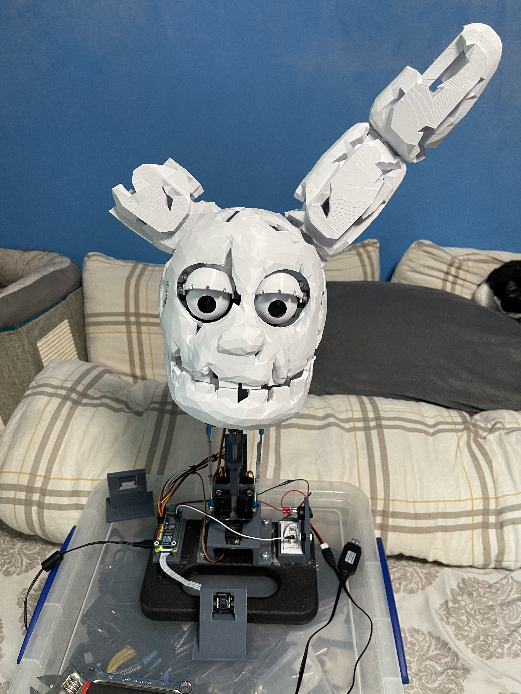
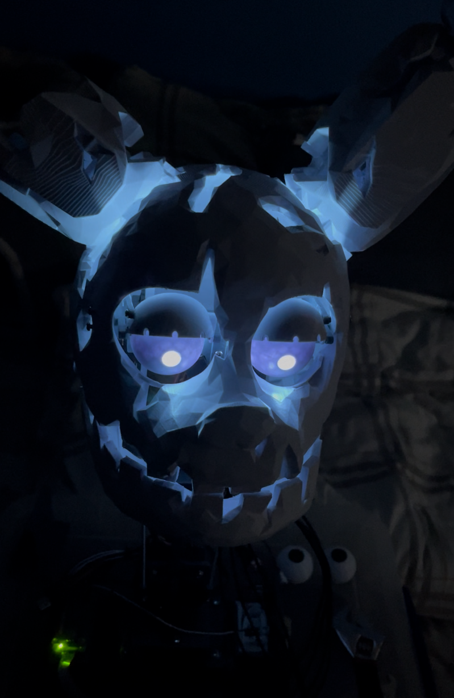
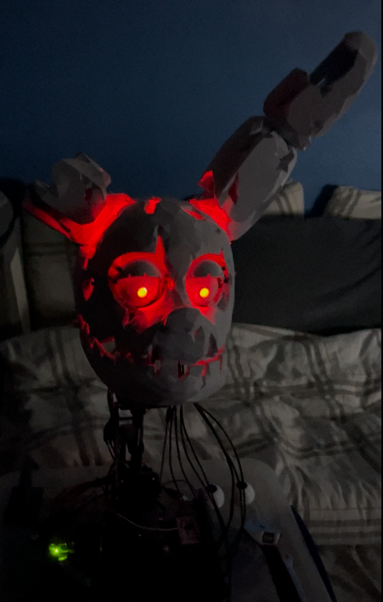

# Springtrap Animatronic Project

[docs folder](./docs/)

## Introduction

This project is inspired by **Springtrap**, a character from the indie horror game *Five Nights at Freddy’s*. The goal is to create a fully articulated, lifelike animatronic head mounted on a motorized neck.

The animatronic structure is almost entirely **3D printed**, with multiple **servo motors** used to replicate natural movements such as jaw articulation, eye movement, eyelid motion, and head rotation. While the ears are purely cosmetic, all other facial components are functional and designed to be easily serviced or modified.

## Features

- Fully articulated animatronic head  
- Motorized neck for head rotation and inclination  
- Independent control of:
  - Jaw
  - Eyes
  - Eyelids
  - Chin / head tilt
- Modular, serviceable 3D-printed design
- Command-line interface for manual control
- Camera-based object tracking using **OpenCV**
- Multi-color LED eyeballs (Newest addition)

## Hardware

- Raspberry Pi Zero 2 W
- PCA9685 16-channel servo driver HAT

## Computer Vision & Tracking

The project has evolved beyond simple scripted movements. With the addition of a **camera module** and **OpenCV**, Springtrap is capable of detecting and tracking objects in real time. This allows the animatronic to respond dynamically to its environment, producing movements that feel significantly more lifelike and unsettling.

## Project Goals

- Create a realistic animatronic head using accessible hardware  
- Maintain clean, modular code for easy expansion  
- Combine mechanical motion with computer vision  
- Serve as a learning platform for robotics, servos, and OpenCV

## Power Notes
> ⚠️ Always use the soft shutdown button before turning off the hard power switch to avoid SD card corruption.

## IMG

